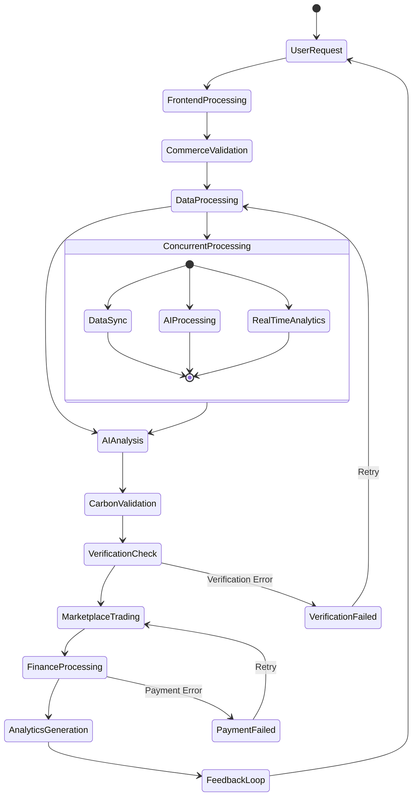
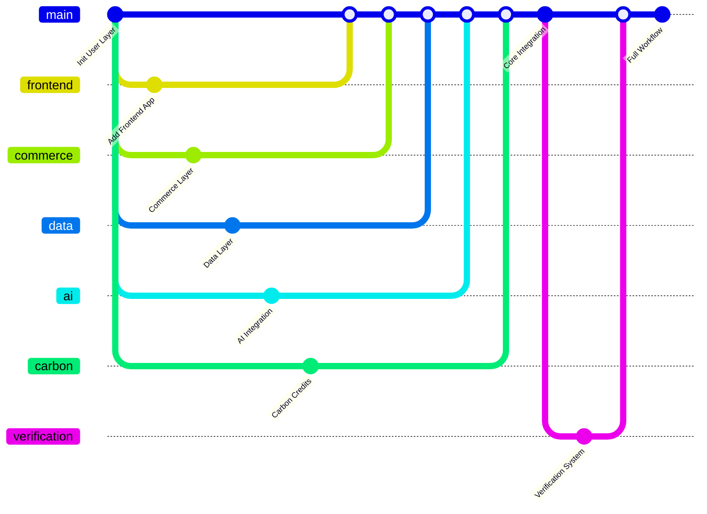

# Senken+1 Animated Workflow

```mermaid
graph TD
    %% Node Definitions with Styling
    User[👤 User Layer]:::user
    Frontend[💻 Frontend App]:::frontend
    Commerce[🛍️ Commerce Layer]:::commerce
    Data[🗄️ Data Layer]:::data
    AI[🤖 AI Layer]:::ai
    Carbon[🌱 Carbon Layer]:::carbon
    Verification[✅ Verification Layer]:::verification
    Marketplace[💹 Marketplace Layer]:::marketplace
    Finance[💰 Finance Layer]:::finance
    Analytics[📊 Analytics Layer]:::analytics
    Feedback[🔄 User Feedback Loop]:::feedback

    %% Workflow Connections
    User -->|Request| Frontend
    Frontend -->|Browse| Commerce
    Commerce -->|Process| Data
    Data -->|Analyze| AI
    AI -->|Validate| Carbon
    Carbon -->|Verify| Verification
    Verification -->|Trade| Marketplace
    Marketplace -->|Pay| Finance
    Finance -->|Report| Analytics
    Analytics -->|Insights| Feedback
    Feedback -->|Update| User

    %% Real-time Bidirectional Connections
    Frontend <-->|Real-time Sync| Data
    AI <-->|ML Pipeline| Carbon
    Analytics <-->|Live Data| Commerce

    %% CSS Classes for Styling
    classDef user fill:#d5e8d4,stroke:#82b366,stroke-width:3px,color:#2e7d32
    classDef frontend fill:#dae8fc,stroke:#6c8ebf,stroke-width:3px,color:#1565c0
    classDef commerce fill:#fff2cc,stroke:#d6b656,stroke-width:3px,color:#f57c00
    classDef data fill:#f8cecc,stroke:#b85450,stroke-width:3px,color:#c62828
    classDef ai fill:#e1d5e7,stroke:#9673a6,stroke-width:3px,color:#7b1fa2
    classDef carbon fill:#d5e8d4,stroke:#82b366,stroke-width:3px,color:#2e7d32
    classDef verification fill:#dae8fc,stroke:#6c8ebf,stroke-width:3px,color:#1565c0
    classDef marketplace fill:#fff2cc,stroke:#d6b656,stroke-width:3px,color:#f57c00
    classDef finance fill:#f8cecc,stroke:#b85450,stroke-width:3px,color:#c62828
    classDef analytics fill:#e1d5e7,stroke:#9673a6,stroke-width:3px,color:#7b1fa2
    classDef feedback fill:#d5e8d4,stroke:#82b366,stroke-width:3px,color:#2e7d32

    %% Animation Classes
    classDef animate stroke:#ff5722,stroke-width:4px,stroke-dasharray: 5 5
    class User,Frontend,Commerce,Data,AI,Carbon,Verification,Marketplace,Finance,Analytics,Feedback animate
```



## Animated Sequence Diagram

```mermaid
sequenceDiagram
    participant U as 👤 User
    participant F as 💻 Frontend
    participant C as 🛍️ Commerce
    participant D as 🗄️ Data
    participant A as 🤖 AI
    participant C2 as 🌱 Carbon
    participant V as ✅ Verification
    participant M as 💹 Marketplace
    participant Fi as 💰 Finance
    participant An as 📊 Analytics
    participant Fe as 🔄 Feedback

    %% Main Workflow
    U->>F: Initiate Request
    F->>C: Browse Products
    C->>D: Process Data
    D->>A: Analyze Patterns
    A->>C2: Validate Credits
    C2->>V: Verify Compliance
    V->>M: Enable Trading
    M->>Fi: Process Payment
    Fi->>An: Generate Reports
    An->>Fe: Provide Insights
    Fe->>U: Update Experience

    %% Real-time Interactions
    loop Continuous Processing
        D<-->F: Real-time Sync
        A<-->C2: ML Pipeline
        An<-->C: Live Analytics
    end

    %% Error Handling
    alt Verification Failed
        V->>C2: Request Re-validation
        C2->>A: Re-analyze Data
    else Payment Failed
        Fi->>M: Cancel Transaction
        M->>U: Notify Error
    end
```

## State Diagram for Dynamic Workflow



## Git Flow Integration



## Installation Instructions

### VS Code Extensions to Install:

1. **Markdown Preview Mermaid Support**
   - Search: "Markdown Preview Mermaid Support"
   - ID: `bierner.markdown-mermaid`

2. **Mermaid Markdown Syntax Highlighting**
   - Search: "Mermaid Markdown Syntax Highlighting"
   - ID: `bpruitt-goddard.mermaid-markdown-syntax-highlighting`

3. **PlantUML** (Alternative)
   - Search: "PlantUML"
   - ID: `jebbs.plantuml`

### GitHub Rendering:
- Mermaid diagrams render automatically on GitHub
- No additional setup needed for GitHub Pages
- Works in GitHub Issues, Pull Requests, and Wikis

### Animation Features:
- **Interactive nodes** - Click to highlight paths
- **Hover effects** - Mouse over for details
- **Zoom capabilities** - Scroll to zoom in/out
- **Export options** - PNG, SVG, PDF
- **Real-time collaboration** - Multiple users can view

This approach gives you n8n-style animated workflows that work perfectly on GitHub!
